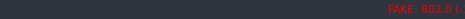

# Crypto Price Tracker



```bash
$ crypto-price --help
Realtime Crypto Price Tracker

Usage:
  crypto-price [flags] {exchange:ticker}...

Flags:
      --debug               Enable debug log
  -h, --help                help for crypto-price
      --i3bar               i3bar format (default true)
      --i3bar-icon          Enable icons. (https://github.com/AllienWorks/cryptocoins)
      --i3bar-sort string   sort markets by change. values: keep, inc, dec (default "keep")
      --json                json format
      --jsonl               json line format
      --satoshi             convert btc market price to satoshi
  -t, --template string     golang template format
      --version             version for crypto-price
```

example: `crypto-price --satoshi --jsonl coinbase:btc-usd bittrex:btc-amp binance:xrp-btc`

i3blocks config:

```
[crypto]
command=/path/to/crypto-price --satoshi --i3bar --i3bar-sort dec coinbase:btc-usd bittrex:btc-amp bittrex:btc-xrp
interval=persist
markup=pango
```

## Suported exchanges

|                                                                                                                 | id       | name                                     |
|-----------------------------------------------------------------------------------------------------------------|----------|------------------------------------------|
|  | binance  | [Binance](https://www.binance.com/)      |

[//]: # (badges stolen from https://github.com/ccxt/ccxt)

## Supported Formatters

- json
- server
- golang template
- polybar

## Install

```bash
go get github.com/u3mur4/crypto-price/bin/crypto-price
```
